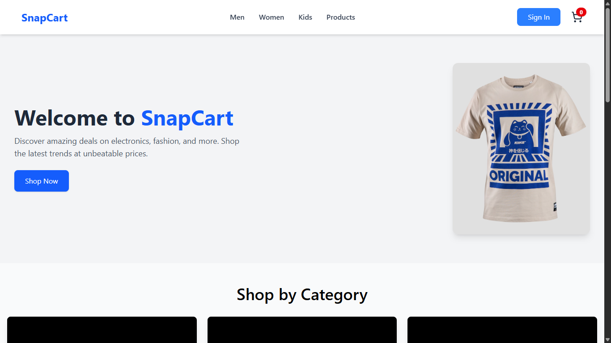

# SnapCart - E-Commerce Frontend

SnapCart is a modern e-commerce website frontend built using **React.js**, **Tailwind CSS**, and **Clerk OAuth** for authentication. This project focuses on providing a sleek, user-friendly shopping experience, including features such as user authentication, product listing, and a fully functional **Add to Cart** page.  

> **Note:** This is the **frontend part only**. Backend integration is not included.

---

## Features

- **User Authentication**: Integrated with [Clerk OAuth](https://clerk.dev/) for secure sign-in and sign-up.  
- **Add to Cart**: Users can add products to the cart and view their selected items.  
- **Responsive Design**: Fully responsive layout designed with **Tailwind CSS**.  
- **Modern UI**: Clean and user-friendly interface for a seamless shopping experience.  

---

## Technologies Used

- **React.js** - Frontend library for building interactive UI.  
- **Tailwind CSS** - Utility-first CSS framework for rapid styling.  
- **Clerk OAuth** - Authentication solution for managing users and sessions.  
- **JavaScript (ES6+)** - Core scripting language for interactivity.  
- **React Router** - For handling page navigation.  
- **Lucide Icons** - For modern, lightweight icons.  

---

## Screenshots

### Home Page


### Cart Page


### Sign-in Page


## Setup & Installation

1. **Clone the repository**  
```bash
git clone https://github.com/W-lakhi-W/snapcart-frontend.git
cd snapcart

2. Install dependencies
npm install

3. Start the development server
npm run dev

